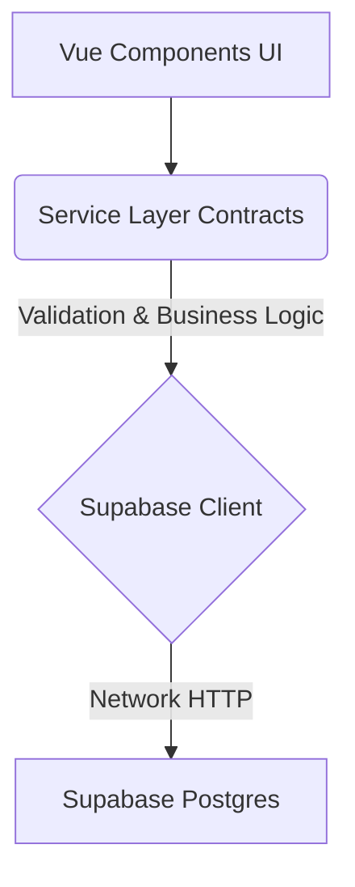

# LuthierApp - Technical Documentation

## Overview

LuthierApp is a comprehensive management system for Luthiers (Musical Instrument Builders and Repairers). It is built as an SPA (Single Page Application) using **Vue 3** (Composition API) and paired with **Supabase** acting as a full backend-as-a-service (BaaS), providing PostgreSQL, Authentication, Storage, and Row Level Security (RLS). The focus of this web application is on memory efficiency, security (no mass assignment vulnerabilities), and cross-device responsiveness.

## Technology Stack

- **Frontend Framework:** Vue 3 (Composition API / Setup script)
- **Tooling:** Vite
- **Styling:** Vanilla CSS (Global variables injected via Javascript, dynamic theming support)
- **Backend/Database:** Supabase (PostgreSQL, Realtime, Storage, Auth)
- **Authentication:** Supabase Auth (Email/Password Magic Link)
- **Dependencies:** `chart.js` (for rendering charts), `jspdf` & `html2canvas` (document generation), `qrcode` (labels), `pwa/vite-plugin` (Progressive Web App support).

---

## System Architecture: The Service Layer Pattern

To ensure scalability, robust security checking, and DRY principles, the frontend abstains from running direct `<Supabase>` queries inside `.vue` graphic components. Instead, the logic flows through a structured "Service Layer".



### Services Available (`src/services/`)

1. **`authService.js`**: Handles session persistence, user login, logout, password resets, and token validations.
2. **`adminService.js`**: Critical file. Secures system settings, validating RLS payloads. Ex: `salvarConfiguracoes(payload)`. Checks if current user holds ownership (`user_id` mapping). Handles system master roles (SuperAdmin access).
3. **`clienteService.js`**: Controller for CRM CRUD (Clients). Contains pagination handling and name standardizations.
4. **`instrumentoService.js`**: Handles guitar/bass registrations. Relational mapping between instruments and their native owners (Clients).
5. **`osService.js`**: The heaviest controller. Manages Service Orders (Ordem de Serviço). Contains:
   - Creation of OS logic.
   - Status updates ("In Progress", "Delivered").
   - Post-sales algorithm (`buscarOportunidadesPosVenda()`).
   - Vulnerability safeguarded: Uses restricted payload `whitelist` to prevent Mass Assignment bypassing.
6. **`financeiroService.js`**: Connects OS budgets (Orçamentos) and Payments (Transações). Aggregates monthly income and handles explicit date range filtering.
7. **`catalogoService.js`**: Fast CRUD for standard predefined prices and services to populate budgets easily.

---

## File Structure & Component Mapping

### Root Structural Files

- `src/App.vue`: The Main Orchestrator. Evaluates session tokens, initializes global states, provides visual themes through root variables, and routes views via conditional rendering (`v-if`/`v-else-if`).
- `src/main.js`: Vue app entrypoint. Instantiates App and handles general setups.
- `src/style.css`: Core design system defaults, classes like `.card`, `.btn-primary`, loaders, animations.

### High-Level Views

- `DashboardAtividades.vue`: The "Bancada". Main dashboard where active OS elements gather. Integrates the CRM Retention algorithms.
- `AdminArea.vue`: Gateway for `Configuracoes.vue` (Visual Themes/Logo), `Financeiro.vue` (Expense Tracking & Charts), `ConfiguracoesPagamento.vue`.
- `CatalogoManager.vue`: Administration table for predefined tasks.
- `HistoricoServicos.vue`: Archiving feature displaying completed orders.

### OS Management Engine (The core Flow)

- `ExecucaoServico.vue`: The maestro governing an active Service Order. Subdivides into:
  - `os/AbaChecklist.vue`: Initial condition assessment of instruments.
  - `os/AbaDiario.vue`: Activity log (Timeline of repairs + picture uploads).
  - `os/AbaOrcamento.vue`: Invoice builder + PDF export generation.
  - `os/AbaReceber.vue`: P.O.S terminal. Accepts partial payments and closes the OS ticket.

---

## Security Policies (Backend RLS)

Most tables enforce rigorous PostgREST RLS (Row Level Security). The service layer automatically attaches the `{ user_id }` derived from the session.

- Example security barrier: A user cannot update configurations nor modify transactions outside their `user.id`.
- Known leaks related to large dataset consumption (e.g. Finance History queries) have been paginated mathematically to request `.gte(Date)` instead, safeguarding Node loops and client memory.

## Build and Deployment

The project incorporates a Vite PWA plugin, enabling offline-friendly attributes and quick installation on mobile.

```bash
# Standard dev cycle
npm run dev

# Full build targeting static dist
npm run build
```

The output behaves gracefully deployed on standard CDN ecosystems.
